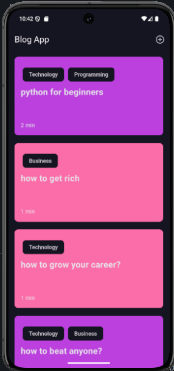
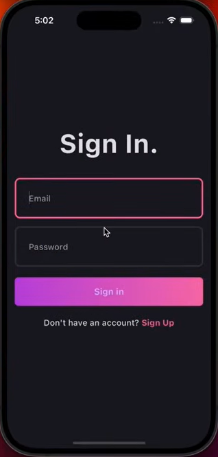
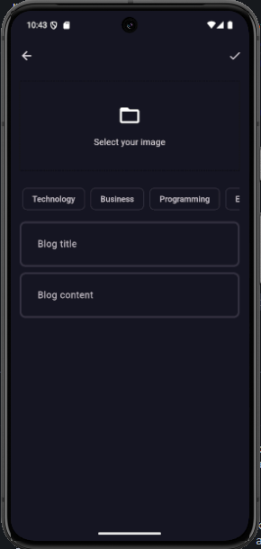
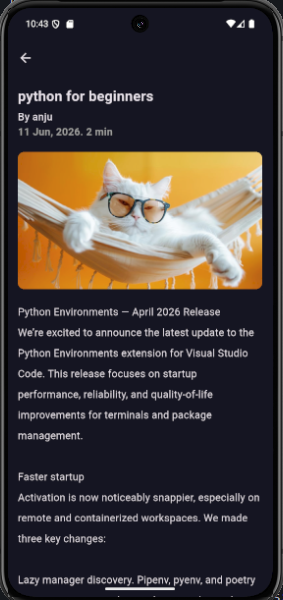

# Blog App

A full-stack Flutter Blog Application built using Clean Architecture, BLoC state management, Supabase backend, and Hive local storage.

## Features

* User Authentication (Sign Up & Login)
* Blog Creation and Publishing
* Image Upload Support
* Topic Categorization
* Offline Blog Caching using Hive
* State Management with BLoC
* Dependency Injection using GetIt
* Responsive UI

## Tech Stack

### Frontend

* Flutter
* Dart

### State Management

* flutter_bloc (BLoC)

### Backend

* Supabase Authentication
* Supabase Database
* Supabase Storage

### Local Storage

* Hive

### Dependency Injection

* GetIt

## Project Architecture

The project follows Clean Architecture principles:

lib/
├── core/
├── features/
│   ├── auth/
│   └── blog/
├── init_dependencies.dart
└── main.dart

## Screenshots

### Login Page

(Add Screenshot Here)

### Sign Up Page

(Add Screenshot Here)

### Blog Feed

(Add Screenshot Here)

### Create Blog

(Add Screenshot Here)

## Getting Started

1. Clone the repository

git clone https://github.com/anjanapradeesh/blog_app.git

2. Install dependencies

flutter pub get

3. Configure Supabase credentials

Create:

lib/core/secrets/app_secrets.dart

and add:

class AppSecrets {
static const supabaseUrl = 'YOUR_SUPABASE_URL';
static const supabaseAnonKey = 'YOUR_SUPABASE_ANON_KEY';
}

4. Run the application

flutter run

## Screenshots

### Home Page

### Sign In Page

### Sign Up Page

### Add Blog Page

### Blog Details Page

## Author

Anjana Pradeesh
MCA Student | Flutter Developer
